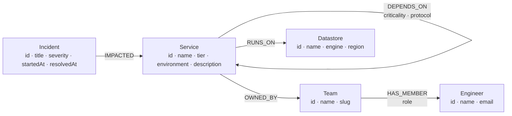

# Faultline

Dependency blast-radius for incident response, backed by [CognoDB](https://console.cognodb.com).

When a service starts failing, the first two questions in the incident channel are always the same: **what else is going to break, and who do I need to page?** Faultline answers both from a single graph traversal.

- **Live demo:** _add your deployment URL_
- **Screen recording:** _add your recording link_

---

## The use case

A platform of a hundred-odd services is a directed graph of dependencies, not a list of rows. `checkout-api` needs `ledger`, `ledger` needs `postgres-proxy`. When `postgres-proxy` degrades, the outage travels _upstream_ along those edges, and the set of teams that need to be involved is discovered by walking the same edges into ownership.

Faultline models that estate and answers one question well:

> Given a service that has started failing, which other services are in the blast radius, how certain is each one to fail, and who is on call for it?

The application deliberately does one thing. There is no CRUD, no auth and no catch-all dashboard: an on-call engineer opens a service, sees the impact cone, and gets a paging list.

### Certain outage vs. degraded

Every `DEPENDS_ON` edge carries a `criticality` of `hard` or `soft`. A hard dependency means the caller cannot function without it; a soft one means the caller degrades but survives.

That distinction is a property of the **relationship**, not of either service — `checkout-api` needing `ledger` is critical, while `checkout-api` needing `rewards` is not, and neither fact belongs on a service row. Because it lives on the edge, the traversal can grade the result: a downstream service is reported as a **certain outage** only if there exists a path back to the origin on which _every_ edge is hard. Otherwise it is **degraded**.

This is what turns a flat list of "things connected to X" into an actionable page-list.

---

## Why a graph database?

The core query is: _find every service that can reach this one through one to four `DEPENDS_ON` edges, and for each, decide whether some path to it is hard the whole way._

In a relational schema that is a recursive CTE over a `service_dependencies` join table. It works, but three things hurt:

1. **Depth is not free.** Each extra hop is another round of the recursion against an ever-growing intermediate result. Traversal in a graph database follows pointers between stored records, so cost tracks the size of the neighbourhood actually visited rather than the size of the table.
2. **The interesting predicate is over a path, not a row.** "Every edge along this route is hard" has no natural relational expression — you have to materialise paths as arrays inside the recursive term and post-filter them. In Cypher it is one clause:
   `all(edge IN relationships(p) WHERE edge.criticality = 'hard')`.
3. **The traversal changes relationship type midway.** After walking `DEPENDS_ON` an arbitrary number of times, the same query pivots onto `OWNED_BY` and then `HAS_MEMBER` to resolve the on-call engineer. Relationally that is a recursive CTE joined against three more tables; in the graph it is three more pattern segments in the same statement.

The dataset is not large. The reason for a graph database here is not volume, it is that **the questions are about paths**, and paths are what this model stores natively.

---

## Data model



| Node        | Meaning                                                                         |
| ----------- | ------------------------------------------------------------------------------- |
| `Service`   | A deployable unit. `tier` is 1 (customer-facing) to 3 (shared infrastructure).  |
| `Team`      | The group that owns one or more services.                                       |
| `Engineer`  | A person. Reached through `HAS_MEMBER`, whose `role` marks the current on-call. |
| `Datastore` | Backing storage a service runs on.                                              |
| `Incident`  | A past or ongoing incident. `resolvedAt` is null while it is open.              |

### Direction matters

`(a)-[:DEPENDS_ON]->(b)` reads _a needs b_. Failure therefore propagates in the **opposite** direction to the arrow, which is why the blast-radius query traverses the edge backwards:

```cypher
MATCH path = (impacted:Service)-[:DEPENDS_ON*1..4]->(origin:Service {id: $id})
```

`impacted` is bound to everything that can reach the origin — that is precisely the set that breaks when the origin does.

---

## The queries

All Cypher lives in [`lib/queries`](lib/queries). Every value is passed as a `$parameter`; no query is built by string concatenation.

### 1. Blast radius — multi-hop, and awkward in SQL

[`lib/queries/blastRadius.ts`](lib/queries/blastRadius.ts)

```cypher
MATCH path = (impacted:Service)-[:DEPENDS_ON*1..4]->(origin:Service {id: $id})
WHERE length(path) <= $depth AND impacted <> origin
WITH impacted,
     min(length(path)) AS hops,
     collect(path)     AS paths
WITH impacted, hops,
     any(p IN paths
         WHERE all(edge IN relationships(p) WHERE edge.criticality = 'hard')) AS certain
MATCH (impacted)-[:OWNED_BY]->(team:Team)
OPTIONAL MATCH (team)-[membership:HAS_MEMBER]->(engineer:Engineer)
  WHERE membership.role = 'on-call'
RETURN impacted.id AS id, impacted.name AS name, impacted.tier AS tier,
       hops, certain, team.name AS team,
       engineer.name AS onCall, engineer.email AS onCallEmail
ORDER BY certain DESC, hops, impacted.tier, impacted.name
```

Line by line:

- The variable-length pattern `*1..4` walks one to four dependency hops backwards from the origin. Cypher requires **literal** bounds on that range, so the pattern is fixed at the widest depth the UI offers and the user's chosen depth is applied as a parameterised `length(path) <= $depth` filter. That keeps the query parameterised without concatenating the bound into the string.
- `min(length(path))` collapses the many routes that may exist between two services into the shortest one, which is the number the UI reports as distance.
- `any(... all(...))` is the grading step: a service is a certain outage if _at least one_ of its routes to the origin is hard on _every_ edge. This predicate spans a whole path and is the part a relational engine handles worst.
- The final `MATCH`/`OPTIONAL MATCH` continue the same traversal onto ownership, so impact and paging information come back in one round trip. `OPTIONAL` is used because a team may temporarily have no on-call, and that should render as "Unassigned" rather than dropping the affected service from the results.
- The on-call filter is written as an explicit `WHERE membership.role = 'on-call'` rather than the shorter inline form `-[:HAS_MEMBER {role: 'on-call'}]->`. On the instance this was built against, the inline property map was not applied inside `OPTIONAL MATCH`: every team member came back instead of only the on-call, which multiplied each impacted service into one row per member. The `WHERE` form filters correctly and is what the query uses throughout.

### 2. Dependency edges inside the radius

Returns only the edges whose endpoints are both already on screen, so the visualisation draws the real dependency structure rather than a star around the origin.

```cypher
MATCH (source:Service)-[edge:DEPENDS_ON]->(target:Service)
WHERE source.id IN $ids AND target.id IN $ids
RETURN source.id AS source, target.id AS target, edge.criticality AS criticality
```

### 3. Service catalogue

[`lib/queries/services.ts`](lib/queries/services.ts) — search and tier filter, with a count of open incidents per service. Both filters are parameterised and made optional inside the query (`$search = '' OR ...`), so one statement serves every combination of filters instead of four assembled variants.

### 4. Service overview

Resolves a service's team, current on-call, datastores and incident history in a single statement.

---

## Running it

### 1. Create a CognoDB instance

1. Sign up at [console.cognodb.com/signup](https://console.cognodb.com/signup) — the free tier needs no card.
2. Create a free `c0` instance and pick a region.
3. Copy the connection URI (`bolt+s://<instance-id>.databases.cognodb.cloud`) and the generated password for the user `cognodb`. **The password is shown once.**

### 2. Configure

```bash
cp .env.example .env
```

```dotenv
COGNODB_URI=bolt+s://<instance-id>.databases.cognodb.cloud
COGNODB_USER=cognodb
COGNODB_PASSWORD=<your password>
```

`.env` is git-ignored. No credential is committed to this repository, and the application reads all three values from the environment at runtime.

### 3. Install and seed

```bash
npm install
npm run seed
```

The seed script clears the graph, creates uniqueness constraints, and loads the dataset with batched `UNWIND` statements. It is deterministic — the same graph is produced on every run.

### 4. Run

```bash
npm run dev
```

Open <http://localhost:3000>.

---

## The dataset

Generated by [`scripts/seed.mjs`](scripts/seed.mjs): 66 services, 8 teams, 32 engineers, 8 datastores and 30 incidents, joined by roughly 400 relationships.

Services are laid out in four dependency layers — infrastructure, platform, domain, product — and only ever depend downwards, which keeps the graph acyclic and mirrors how a real platform is stratified. Dependency criticality, ownership and incident history are drawn from a fixed-seed PRNG so the demo is reproducible.

The size is chosen for legibility rather than scale: a blast radius of a few dozen services is something a human can actually read, and it sits comfortably inside the free instance's 256 MB.

---

## Project structure

```
app/
  layout.tsx              shell, typography, navigation
  page.tsx                service catalogue
  services/[id]/page.tsx  blast radius, depth selector
components/               presentation only
lib/
  db/driver.ts            pooled driver, configuration, error translation
  queries/                every Cypher statement in the codebase
  types.ts                shapes returned by the queries
scripts/seed.mjs          data loader
```

Three conventions hold the codebase together:

- **All Cypher lives in `lib/queries`.** Nothing else in the application constructs a query, so the full set of statements can be reviewed in one folder.
- **Components never touch the driver directly.** They call a named query function, which keeps rendering free of database concerns.
- **Data is fetched in server components.** Pages await the query inside a `Suspense` boundary, which is what produces the loading state; there are no client-side fetches and no API layer that would only ever be called by this application.

### Error handling

`lib/db/driver.ts` translates every failure mode — missing configuration, DNS or TLS failure, bad credentials, timeout — into a single `DatabaseUnavailableError`. Components catch it and render a recoverable panel explaining that the instance is unreachable. Stopping the CognoDB instance degrades the application into that state rather than a stack trace.

### Dependencies

Runtime dependencies are `next`, `react`, `react-dom` and `neo4j-driver`. There is no charting or graph-drawing library: the impact graph is inline SVG laid out by hop distance, because horizontal position carrying the meaning of "how far from the origin" is more useful here than anything a force-directed layout would produce. Search state lives in the URL rather than a state library, which also makes any view shareable into an incident channel.

---

## Screenshots

_Add screenshots of the catalogue and blast-radius views here._
